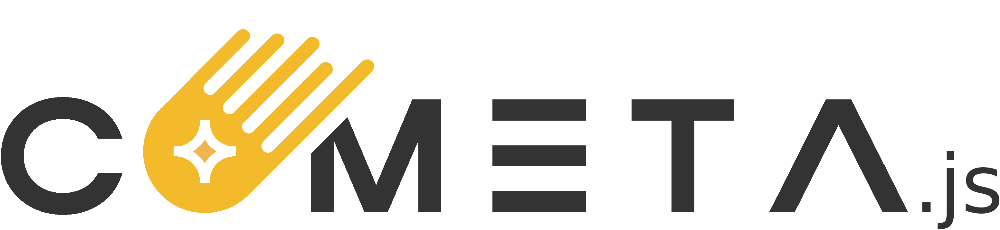

<div align="center">
  <a href="" target="_blank">
    
  </a>
</div>

<br>

<div align="center">


[](https://cometajs.readthedocs.io/en/latest/?badge=latest)
[](https://x.com/BiglupLabs)

</div>

<hr>

Cometa.js is a lightweight, high-performance JavaScript library binding for the [libcardano-c](https://github.com/Biglup/cardano-c) Library, designed to simplify blockchain development on Cardano.

It embeds the WASM module directly into a single JavaScript file, ensuring a minimal footprint, fast performance, and effortless setup without requiring special server configurations.

Built on the foundation of [libcardano-c](https://github.com/Biglup/cardano-c), Cometa.js inherits its commercial-grade quality, rigorous testing, and adherence to strict standards. It is ideal for developing reliable and secure solutions for mission-critical blockchain applications.
<hr>

- [Official Website](https://cometa.dev/)
- [Installation](#installation)
- [Documentation](https://cometajs.readthedocs.io/en/latest/?badge=latest)

<hr>

### **Installation**

To install Cometa.js on your project, use the following command:

```bash
yarn add @biglup/cometa
```

<hr>

### **Building and Testing**

To build and run the tests, use the following commands:

```bash
yarn install
yarn build
yarn test
```

<hr>

### **License**

Cometa.js is licensed under the Apache 2.0 License. See the [LICENSE](LICENSE) file for more information.
